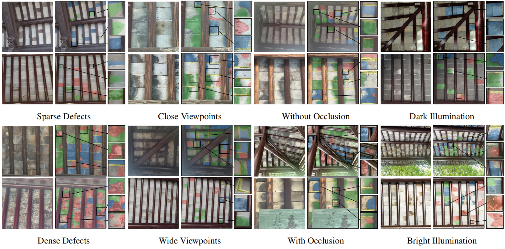

# A2BDefects: Dataset and Benchmark for Ancient Architecture Preservation [](LICENSE)

**A High-Resolution Dataset for Internal Structural Defect Analysis in Ancient Brick Architecture**

  
  


🔗 **Dataset URL**: [https://dataverse.harvard.edu/dataset.xhtml?persistentId=doi:10.7910/DVN/IGUS04](https://dataverse.harvard.edu/dataset.xhtml?persistentId=doi:10.7910/DVN/IGUS04)

---

## 🏛️ Abstract

Ancient architecture preservation is a crucial aspect of cultural heritage conservation. While Artificial Intelligence (AI) holds great promise for automating structural analysis, progress has been hampered by the scarcity of domain-specific datasets with expert-level annotations.

Existing datasets often emphasize external surface materials with coarse annotations, overlooking the complex, subtle, and safety-critical *internal* deterioration. To address this, we introduce **A2BDefects**—a curated dataset for intelligent defect analysis of internal ancient architectural structures.

In collaboration with domain experts, we collected high-resolution images from diverse architectural ensembles under various environmental conditions. The dataset features multi-level annotations, including:

* **Object-level** bounding boxes  
* **Pixel-level** segmentation masks  

We establish robust baselines using two complementary visual instance segmentation paradigms:  

1. **One-stage-segmentation**  
2. **Detection-then-segmentation**  

Comprehensive multi-granular analysis at both image and instance levels reveals key challenges such as:  

* Degradation in model performance under high defect density/severity  
* Significant variance with large-scale defects  
* Domain generalization difficulty in unseen architectural settings  

These insights demonstrate the value of **A2BDefects** in driving forward intelligent approaches for ancient structure preservation.  

---

## ✨ Key Features  

| Feature         | Specification                                    |  
| --------------- | ------------------------------------------------ |  
| Name            | A2BDefects (Ancient-to-Brick Defects)            |  
| Resolution      | **512×512** pixels                                   |  
| Annotations     | **26,162** instances with multi-class labeling   |  
| Defect Types    | water stain (WS), color aberration (CA), surface shedding (SS), and excessive gap (EG) |  
| Annotation Type | Bounding Boxes + Pixel-level Masks (COCO format) |  
| File Format     | JPEG for images, JSON (COCO) for annotations     |  
| License         | CC BY-NC-SA 4.0                                  |  

---

## 📁 Dataset Structure  

```  
WZ/  
├── annotations/  
│   ├── instances_train.json     # Training set annotations  
│   ├── instances_val.json       # Validation set annotations  
│   └── instances_test.json      # Test set annotations  
├── train/                       # 512×512 training images  
├── val/                         # Validation images  
└── test/                        # Test images  
```  

---

## 📊 Annotation Format  

Each annotation includes:  

```json  
{  
  "id": 2023,  
  "image_id": 105,  
  "category_id": 4,  
  "segmentation": [x1, y1, x2, y2, ...],  
  "bbox": [x, y, width, height],  
  "area": 3450.5,  
  "iscrowd": 0  
}  
```  

---

## 🧪 Benchmarking & Baselines  

We benchmark multiple models under two paradigms:  

| Paradigm                       | Models Included                      |  
| ------------------------------ | ------------------------------------ |  
| One-stage-segmentation         | ConvNeXT V2 Mask R-CNN, ResNet Mask R-CNN, Mask2Former, Co-DETR , YOLOv8, YOLOv9, YOLOv10, YOLOv11 |  
| Detection-then-Segmentation    | ConvNeXT V2+SAM, YOLOv11+SAM, DEIM+SAM, Co-DETR+SAM |  

Performance is evaluated on:  
* **mAP** for instance segmentation quality  
* **IoU** for semantic segmentation quality  
* **FPS** for efficiency  

---

## 🚀 Getting Started  

```bash  
# Clone the repository  
git clone https://github.com/yourusername/A2BDefects.git  
cd A2BDefects  
```  

---
## 📚 Reference
Our work is built upon the following resources:

| Resource | Description |  
|----------|-------------|  
| **[COCO Dataset](https://github.com/cocodataset/cocoapi)** | Annotation format reference and evaluation tools |  
| **[MMDetection](https://github.com/open-mmlab/mmdetection)** | OpenMMLab's detection toolbox used for baseline implementations |  
| **[Segment Anything](https://github.com/facebookresearch/segment-anything)** | Foundation model for segmentation tasks (used in detection-then-segmentation pipelines) |
| **[DEIM](https://github.com/ShihuaHuang95/DEIM)** | Dynamic Edge Inference Module for segmentation refinement  |
|**[Co-DETR](https://github.com/Sense-X/Co-DETR)** | Collaborative hybrid transformer architecture for detection tasks  |
|**[YOLO](https://github.com/ultralytics/ultralytics)** | Real-time object detection (v8, v9, v10, v11 implementations)  |


---
## 📬 Contact  

For questions or collaboration requests:  

📧 **[20245227072@stu.suda.edu.cn](mailto:20245227072@stu.suda.edu.cn)**  
🏛️ **School of Computer Science and Technology, Soochow University**  

---
