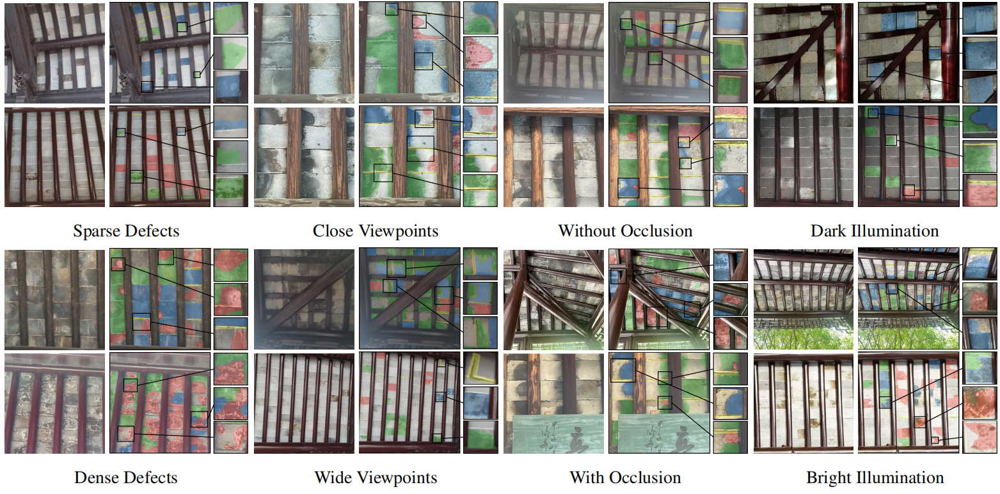
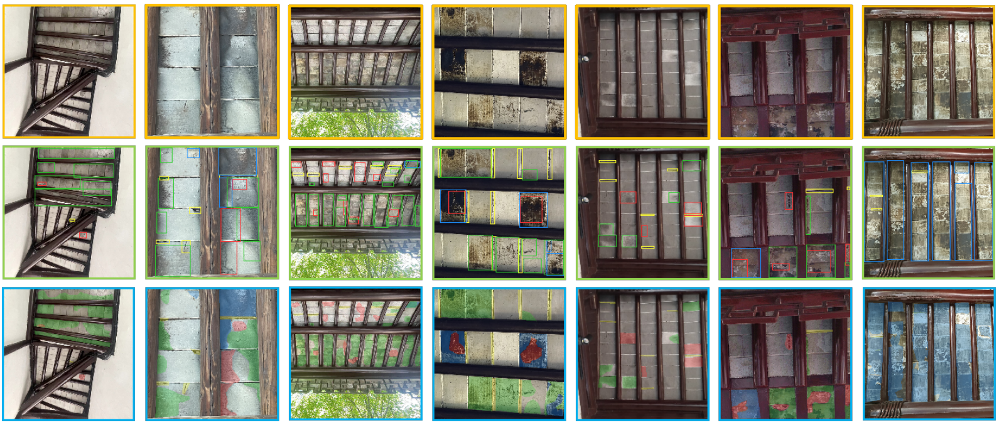

# A2BDefects: 古建筑保护数据集与基准测试 [](LICENSE)

**面向古砖构建筑内部结构缺陷分析的高分辨率数据集**

  
  


🔗 **数据集地址**: [https://dataverse.harvard.edu/dataset.xhtml?persistentId=doi:10.7910/DVN/IGUS04](https://dataverse.harvard.edu/dataset.xhtml?persistentId=doi:10.7910/DVN/IGUS04)

---

## 🏛️ 摘要

古建筑保护是文化遗产保护的重要环节。尽管人工智能在自动化结构分析方面潜力巨大，但缺乏具有专家级标注的领域专用数据集限制了相关进展。

现有数据集多关注外部表面材质且标注粗糙，忽视了复杂、细微且安全敏感的*内部*结构劣化。为此，我们推出**A2BDefects**——专为古建筑内部结构智能缺陷分析打造的标注数据集。

通过与领域专家合作，我们收集了不同建筑群落在多种环境条件下的高分辨率图像。数据集包含多级标注：
* **目标级**边界框  
* **像素级**分割掩码  

我们建立了两种互补的视觉实例分割范式作为基准：
1. **单阶段分割**  
2. **检测后分割**  

通过图像级和实例级的综合分析，揭示了关键挑战：
* 高缺陷密度/严重度下的模型性能退化  
* 大尺度缺陷的显著性能波动  
* 未见过建筑场景的领域泛化困难  

这些发现证明了**A2BDefects**在推动古建筑智能保护方案中的价值。

---

## ✨ 核心特性  

| 特性           | 规格描述                                    |  
| --------------- | ------------------------------------------ |  
| 名称           | A2BDefects (Ancient-to-Brick Defects)      |  
| 分辨率         | **512×512** 像素                           |  
| 标注数量       | **26,162** 个多类别标注实例               |  
| 缺陷类型       | 水渍(WS)、色差(CA)、表面脱落(SS)、过大缝隙(EG) |  
| 标注类型       | 边界框 + 像素级掩码 (COCO格式)            |  
| 文件格式       | JPEG图像，JSON标注文件 (COCO标准)         |  
| 许可证         | MIT 协议                                  |  

---

## 📁 数据集结构  

```  
WZ/  
├── annotations/  
│   ├── instances_train.json     # 训练集标注  
│   ├── instances_val.json       # 验证集标注  
│   └── instances_test.json      # 测试集标注  
├── train/                       # 512×512训练图像  
├── val/                         # 验证图像  
└── test/                        # 测试图像  
```  

---

## 📊 标注格式  

每个标注包含：  

```json  
{  
  "id": 2023,  
  "image_id": 105,  
  "category_id": 4,  
  "segmentation": [x1, y1, x2, y2, ...],  
  "bbox": [x, y, 宽度, 高度],  
  "area": 3450.5,  
  "iscrowd": 0  
}  
```  

---

## 🧪 基准测试与基线模型

我们评估了两种范式下的多模型表现：

| 范式                       | 包含模型                          |  
| -------------------------- | --------------------------------- |  
| 单阶段分割                 | ConvNeXT V2 Mask R-CNN, ResNet Mask R-CNN, Mask2Former, Co-DETR, YOLOv8, YOLOv9, YOLOv10, YOLOv11 |  
| 检测后分割                 | ConvNeXT V2+SAM, YOLOv11+SAM, DEIM+SAM, Co-DETR+SAM |  

评估指标包含：  
* **mAP** - 实例分割质量  
* **IoU** - 语义分割精度  
* **FPS** - 推理效率  

---

## 🚀 快速开始  

```bash  
# 克隆仓库  
git clone https://github.com/yourusername/A2BDefects.git  
cd A2BDefects  
```  

---
## 📚 参考文献
本研究基于以下开源资源：

| 资源名称 | 描述 |  
|----------|------|  
| **[COCO数据集](https://github.com/cocodataset/cocoapi)** | 标注格式参考与评估工具 |  
| **[MMDetection](https://github.com/open-mmlab/mmdetection)** | OpenMMLab检测工具箱（用于基准实现） |  
| **[Segment Anything](https://github.com/facebookresearch/segment-anything)** | 分割基础模型（用于检测后分割流程） |  
| **[DEIM](https://github.com/ShihuaHuang95/DEIM)** | 动态边缘推理模块（用于分割优化） |  
| **[Co-DETR](https://github.com/Sense-X/Co-DETR)** | 协同混合Transformer检测架构 |  
| **[YOLO](https://github.com/ultralytics/ultralytics)** | 实时目标检测框架（v8-v11实现） |  


---
## 📬 联系方式  

如有疑问或合作需求请联系：  

📧 **[20245227072@stu.suda.edu.cn](mailto:20245227072@stu.suda.edu.cn)**  
🏛️ **苏州大学计算机科学与技术学院**  
```

---